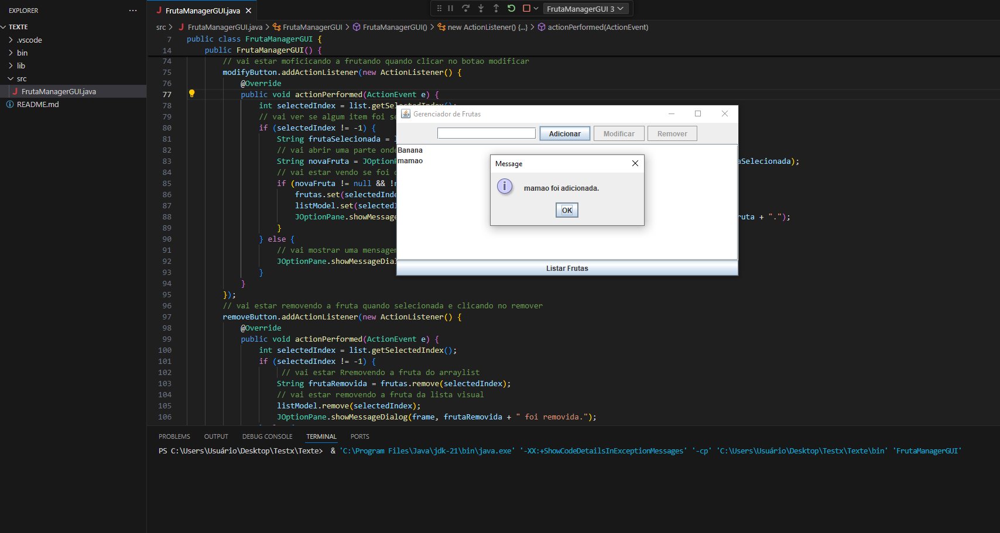

# Lista de Exercícios - GERENCIAMENTO_FRUTAS_GUI

Projeto da matéria de POO FACENS

## 🚀 Começando

* CRIE UM PROJETO JAVA PARA MESCLAR OS CONHECIMENTOS SOBRE O USO DE ARRAY E DE INTERFACES;
* PARA ISSO CONSTRUA UM CÓDIGO QUE TENHA UM INTERFACE E QUE REALIZE AS OPERAÇÕES ENCONTRADAS NO PROJETO DE GERENCIAMENTO DE FRUTAS;
* DURANTE O DESENVOLVIMENTO COMENTE O CÓDIGO CRIADO;

## 🛠️ Construído com

* Visual Code

## 📌 Versão

* **Versão 1.0** 

## ✒️ Autores

* **Abrão Alves Trevizan** - *GERENCIAMENTO_FRUTAS_GUI* 